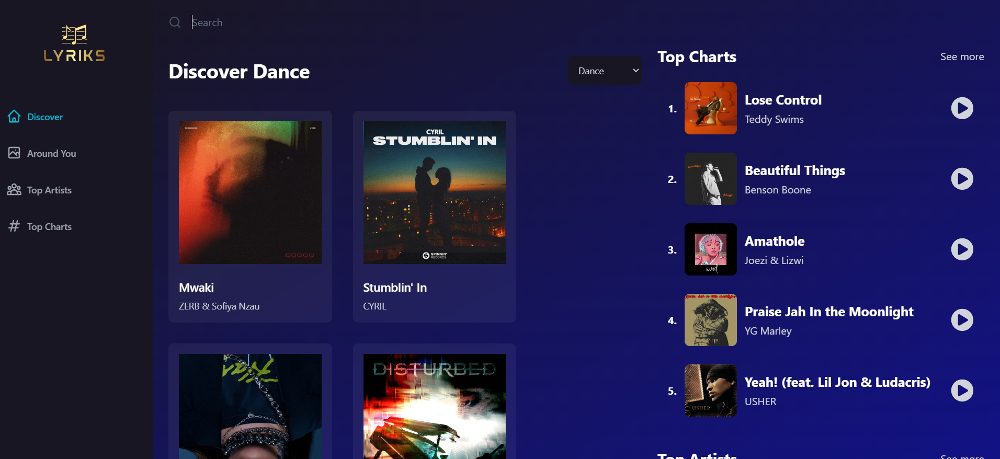
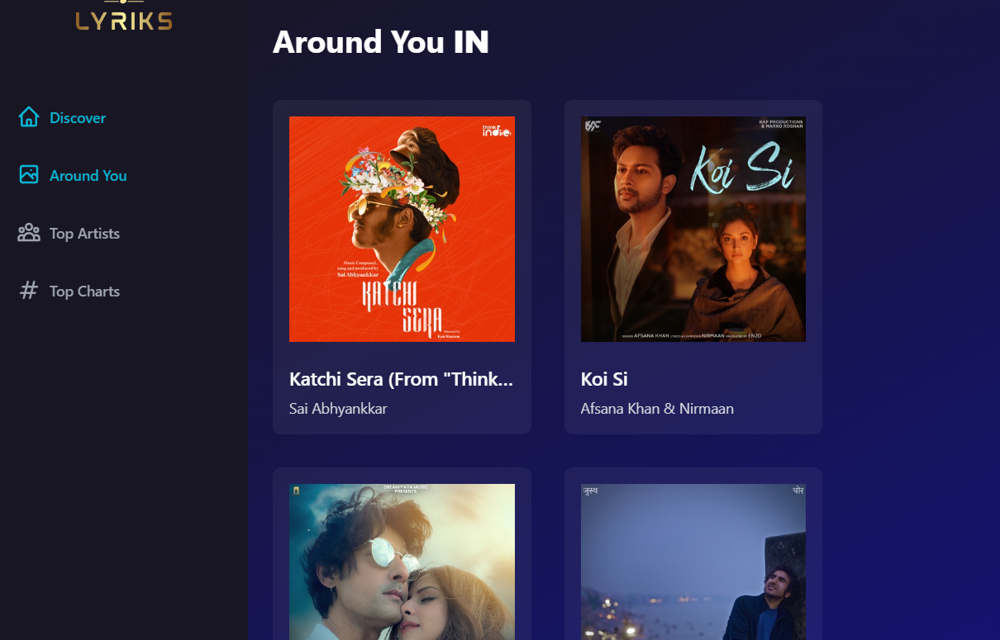
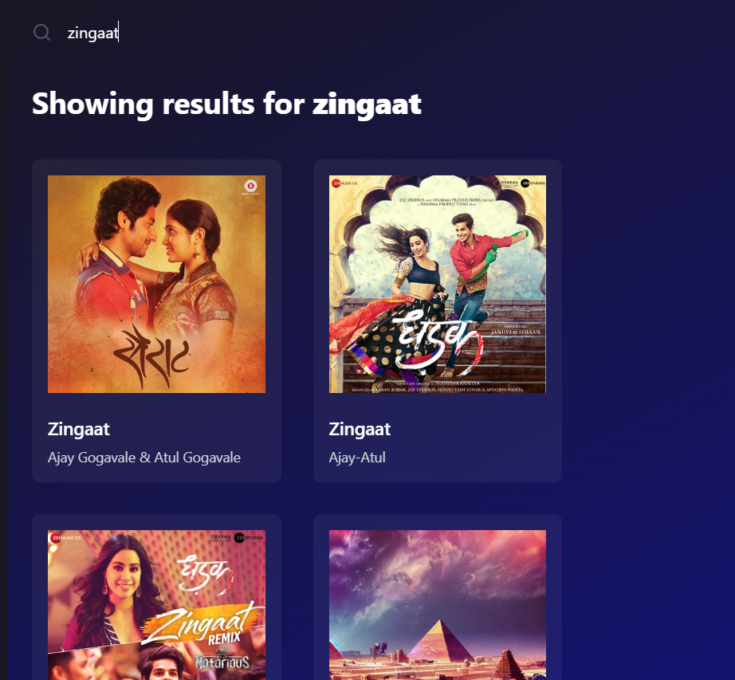
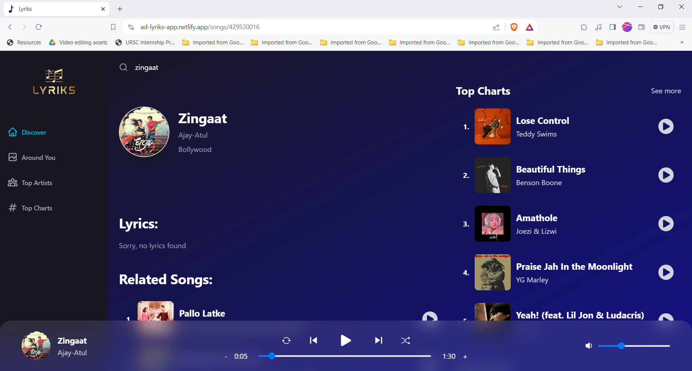

<h1 align="center" id="title">Lyriks</h1>

<p align="center"></p>

<h2>🚀 Demo</h2>

[https://ad-lyriks-app.netlify.app/](https://ad-lyriks-app.netlify.app/)

<h2>Project Screenshots along with its features:</h2>

<p><h4>The landing page of the website</h4>
</p>
<br />



<p><h4>Around You tab, which detects the user's location and lists out all the famous songs in that area.
<h4>The Top Artist's Tab, displays the top artists in the region</h4>
<h4>The Top Charts displays the most played song around the world</h4>
</h4></p>
<br/>

<p><h4>A fully functioning search, to find your favorite song immediately.</h4></p>
<br/>

<p><h4>On playing the song, you can also view the lyrics of the song. </h4>
<h4>You can also play the previous song, increase/decrease the song's volume, and shuffle songs. </h4>
</p>

<h2>🛠️ Installation Steps:</h2>

<p>1. Clone the repository</p>

```
git clone https://github.com/AbhiD1678/Lyriks.git
```

<p>2. Navigate to the project directory:</p>

```
cd Lyriks
```

<p>3. Install dependencies:</p>

```
npm install
```

<p>4. Start the development server:</p>

```
npm start
```

<p>5. Open your web browser and navigate to http://localhost:3000 to view the application</p>  
<p>6.Also,create your own API key from shazam core API and replace it in the .env file.</p>
<h2>💻 Built with</h2>

Technologies used in the project:

*   React
*   Redux Toolkit
*   React Router Dom
*   Tailwind CSS
*   Shazam Core Api
*   React Router Dom

<h2>🛡️ License:</h2>

This project is licensed under the Mit License
